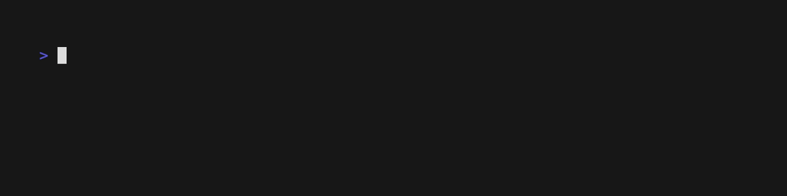

# GreenChoice Usage

## Overview

>

This script automates the process of logging into the GreenChoice website, extracting consumption data for electricity and gas, and comparing costs against yesterdays data.

## Prerequisites

- Node.js v22
- A GreenChoice account with valid login credentials
- Environment variables set for the user email, password

## Installation

```sh
npm install
```

## Configuration

The script requires the following environment variables to be set:

- `GC_USER_EMAIL`: Your GreenChoice user email.
- `GC_USER_PASSWORD`: Your GreenChoice password.
- `GC_TARGET_DATE`: (Optional) The target date for which you want to fetch the consumption data in `yyyy-MM-dd` format. If not provided, the script defaults to yesterday's date.

You can set these variables in a `.env` file at the root of your project:

```
GC_USER_EMAIL=your_email@example.com
GC_USER_PASSWORD=your_password
GC_TARGET_DATE=2024-07-11
```

## Usage

To run the script, use the following command:

```sh
npm start
```

## Logging

The script uses the `debug` module for logging. To enable logging, set the `DEBUG` environment variable:

```sh
DEBUG=greenchoice.usage npm start
```
